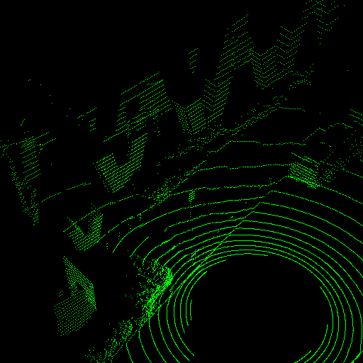

# Temporal LiDAR Frame Prediction for Autonomous Driving

[David Deng](https://davezdeng8.github.io/) and [Avideh Zakhor](http://www-video.eecs.berkeley.edu/~avz/)

[paper](http://www-video.eecs.berkeley.edu/papers/davidDeng/3dv2020_camera_ready.pdf)

In 3DV 2020



## Installation
This code is tested on Python 3.6.9, PyTorch 1.4.0, CUDA 10.2, and Pop!_OS 18.04. 
There are also dependencies on Python packages like Scipy and TensorBoard. 
To evaluate, we recommend you have at least 5 GB of GPU memory available,
and to train, we recommend 24 GB.  

To compile the CUDA kernels for flownet3d_pytorch and PyTorchEMD, 
run the following commands:
```bash
cd lib
python setup.py install
cd ../PyTorchEMD
python setup.py install
cp build/lib.linux-x86_64-3.6/emd_cuda.cpython-36m-x86_64-linux-gnu.so .
cd ..
```
## Usage

### Data preparation
Download the [nuScenes dataset](nuscenes.org) and extract to `/path/to/nuscenes`. 
Then run `python save_batches.py` with the appropriate arguments to preprocess the data. 
This may take a while, especially on the training data. 
```bash
python save_batches.py --nuscenes_dir /path/to/nuscenes --mode train
python save_batches.py --nuscenes_dir /path/to/nuscenes --mode val
python save_batches.py --nuscenes_dir /path/to/nuscenes --mode test
```
We've also included an example processed point cloud sequence in each of the data directories.
Feel free to remove it if you intend to download the dataset.

### Train
To train, run `python train.py`. You can can adjust the input arguments.
The defaults are what we used to train EC w/o DS. The model is saved as `checkpoint.tar`. 

### Test
To test the pretrained models, run `test.py` specifying
which model you want to test and the location of the tar file.
For example, to test PN++ w/ DS, you would run:
```
python test.py --model PNPPDS --checkpoint models/pnppds_f3.tar 
```

## Citation

If you find our work useful in your research, please consider citing:
```BibTeX
@InProceedings{tlfpad,
    title = {Temporal LiDAR Frame Prediction for Autonomous Driving},
    author = {Deng, David and Zakhor, Avideh},
    booktitle = {International Conference on 3D Vision (3DV)},
    year = {2020},
}
```

## Acknowledgements

This code is based on [dgcnn](https://github.com/WangYueFt/dgcnn), 
[flownet3d_pytorch](https://github.com/hyangwinter/flownet3d_pytorch), 
[pyTorchChamferDistance](https://github.com/chrdiller/pyTorchChamferDistance),
and [PyTorchEMD](https://github.com/daerduoCarey/PyTorchEMD).